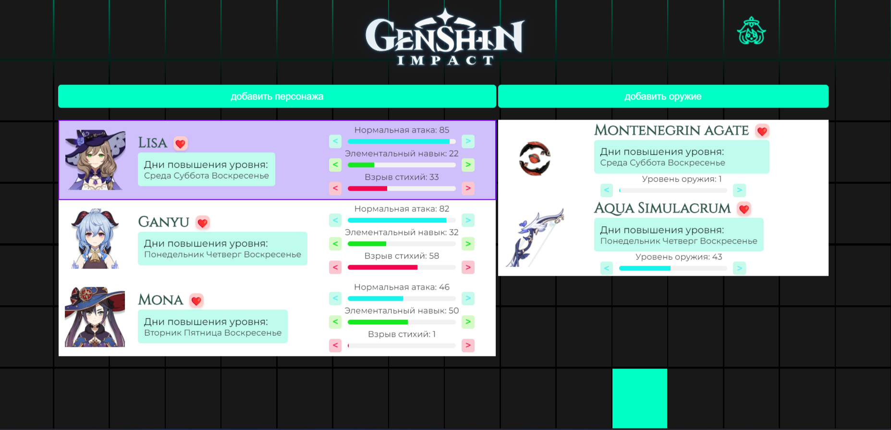
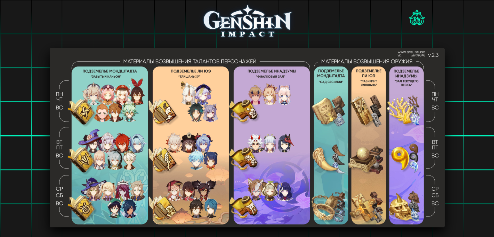

# Курсовая работа по предмету "Информационные Системы и Базы Данных"

## Описание проекта
Данная курсовая работа посвящена разработке базы данных и веб-приложения на основе предметной области игры **"Genshin Impact"**. Приложение помогает пользователям планировать и отслеживать прокачку персонажей и их оружия, используя разработанную базу данных.

## Цель работы
Получение навыков создания и реализации базы данных для веб-приложения, включая:
- Проектирование ER-модели
- Реализацию бизнес-логики
- Разработку SQL-запросов, триггеров и функций
- Развертывание приложения на сервере

## Требования
- **ER-модель** должна включать не менее 10 сущностей и хотя бы одно отношение "многие-ко-многим".
- **СУБД**: PostgreSQL, с использованием SQL и PL/pgSQL.
- **Веб-приложение** использует созданную базу данных.
- Взаимодействие с базой данных через `psql`.

## Этапы работы

### 1. Предметная область
Игра **"Genshin Impact"**, расписание процессов прокачки персонажей и оружия.

### 2. ER-диаграмма
Создание и построение даталогической модели на основе предметной области.

### 3. Реализация БД
- Создание объектов базы данных
- Тестирование данных
- Скрипты для создания/удаления объектов
- Обеспечение целостности данных

### 4. Веб-приложение
Реализация функционала для **планирования и отслеживания прокачки персонажей и оружия**.

